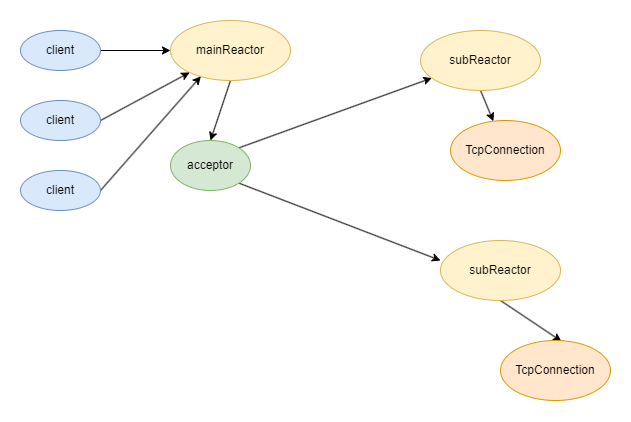
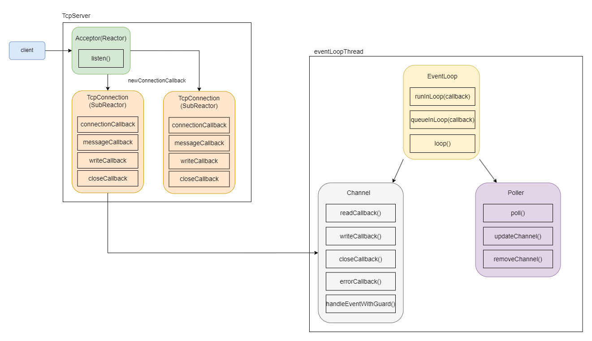

# cgmuduo-muduo库c++11版

muduo是一个基于非阻塞IO和事件驱动的C++网络库，采用Reactor模式和one loop per thread + thread pool线程模型。  

  

## 使用

linux下，项目编译执行`./autobuild.sh`，测试用例进入`example/`文件夹，make生成测试程序  
  
## 类功能介绍
| 核心模块                   |
| -------------------------- |
| Socket                     |
| Buffer                     |
| Channel                    |
| Poller与Epoller            |
| EventLoop与EventLoopThread |
| EventLoopThreadPool        |
| Acceptor                   |
| TcpConnection              |
| TcpServer                  |  
  
`Channel.*`，`Poller.*`，`EventLoop.*`  三类为一体，在底层负责事件循环。**EventLoop**包含**Channel**，**Poller**，**EventLoop**负责轮询访问**Poller**，得到激活**Channel**列表，使**Channel**自己根据自身情况调用相应回调。  

`Thread.*`，`EventLoopThread.*`，`EventLoopThreadPool.*`将线程与**EventLoop**绑定在一起，实现**one loop per thread** + thread pool线程模型。  

`TcpServer.*`，`Acceptor.*`，`TcpConnection.*`为上层Reactor模式的实现。**TcpServer**面向用户，可由用户自定义回调方法以及启动服务器。**Acceptor**也看做分发器，当有新连接到来时，用来将连接转发给子线程处理。**TcpConnection**在子线程处理被分来的连接的具体事件。  
  
## 执行流程

1. 用户创建**TcpServer**对象调用`start()`开启服务器，启动线程池，启动一个**baseLoop**(主线程)，由`runInLoop()`处理**Acceptor**(Reactor)的`listen()`方法，进行监听操作；
2. 一旦有客户端请求连接，**Accetor**调用**TcpServer**设置的**newConnectionCallback_**，将请求分发给**subLoop**(子线程)，即从线程池中取出，然后将连接丢给子线程，由**TcpConnection**处理，此后该连接的所有操作都由该子线程独自处理，与其他线程无关。
3. **TcpConnection**将读，写，关闭，错误操作与回调填充至绑定的**Channel**，然后调用`runInLoop()`和`queueInLoop()`由底层事件循环处理。
4. 底层事件循环中，主线程称为**baseLoop**，只执行监听操作与用户回调。而子线程具体执行操作由**Channel**具体返回的事件所执行。由图所示，蓝色部分由三类组成，**EventLoop**，**Channel**和**Poller**。每个**EventLoop**分别与各自的线程绑定，同时将**Poller**和**Channel**连接起来，调用**loop()**方法将**Channel**的结果送入**Poller**执行，将**Poller**返回的结果各自送入**Channel**执行。

## 学习记录
[muduo剖析(1)](https://www.cgsx.online/archives/muduo%E5%89%96%E6%9E%901)  
[muduo剖析(2)](https://www.cgsx.online/archives/muduo%E5%BA%93%E5%89%96%E6%9E%902#muduo%E5%BA%93%E5%89%96%E6%9E%90(2))

## fix bugs

1. 没有设置ConnectionCallback和MessageCallback，当连接时，报错bad_function_call
> 设置defaultConnectionCallback和defaultMessageCallback，并在构建TcpServer时初始化  
2. Epollpoller.cc:103处发生段错误，似乎是`static_cast<Channel*>`出问题
> 可能因为在Epollpoller:update中同时设置了event.data.ptr和event.data.fd

## 如有问题，欢迎指正，欢迎star